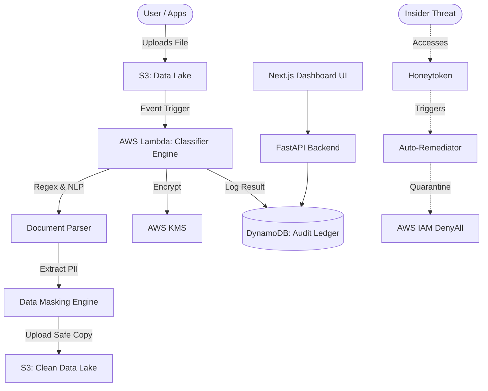

# 🛡️ Enterprise Cloud Data Governance & Security System


> **Automated, Zero-Trust Data Governance Engine for AWS S3 Data Lakes.**

This project is an advanced, military-grade Cloud Security solution built to automatically discover, classify, govern, and protect sensitive data (PII, Financial) within a cloud environment. It simulates an enterprise-level DevSecOps pipeline with **Active Defense** capabilities.

## 🌟 Key Enterprise Features

- **Automated Data Discovery & Classification**: NLP and Regex engine that parses PDFs, CSVs, and JSONs to classify data into `PUBLIC`, `CONFIDENTIAL`, and `RESTRICTED` tiers.
- **Auto-Redaction & Masking**: Dynamically strips and masks sensitive data (e.g., NRIC, Credit Cards) to comply with Data Privacy Laws (PDPA/GDPR), saving safe copies into a Clean Data Lake.
- **KMS Lifecycle Management**: Segregates encryption keys based on classification tiers with automated 90-day rotation policies.
- **Zero-Trust Evaluator (ZTA)**: Blocks access dynamically based on IP threat intelligence, MFA presence, and time-of-day policies.
- **Cyber Deception (Honeytokens)**: Deploys fake high-value assets (`master-db-credentials.json`). Any interaction instantly triggers a critical alert.
- **Active Defense (Auto-Remediation)**: AI anomaly detector triggers instant IAM Quarantine (DenyAll) policies on compromised users attempting exfiltration.
- **Immutable Audit Trail**: Cryptographically chained (SHA-256) DynamoDB ledger to ensure rogue admins cannot tamper with security logs.
- **CSPM & Tagging Enforcer**: Scans the cloud posture for misconfigurations (missing Versioning, open buckets) and quarantines untagged "orphan" data.
- **Next.js Executive Dashboard**: A stunning real-time dark-mode Web UI for CISOs to monitor compliance and active defense logs.
- **cgctl CLI**: Custom terminal application built with `Rich` for hackers and DevSecOps engineers to audit ledgers and deploy traps directly from the shell.

## 🏗️ Architecture



## 🚀 Quick Start (LocalStack)

This project uses `LocalStack` to simulate the entire AWS environment locally.

1. **Start the Infrastructure**
   ```bash
   docker-compose up -d
   ```
2. **Deploy Terraform**
   ```bash
   cd terraform/environments/dev
   terraform init
   terraform apply -auto-approve
   ```
3. **Start the Web Dashboard**
   ```bash
   cd frontend
   npm run dev
   # Open http://localhost:3000
   ```

## 💻 `cgctl` - The Security CLI

Interact with the system like a true DevSecOps Engineer:

```bash
docker exec -it docker-python-dev-1 python scripts/cgctl.py audit
docker exec -it docker-python-dev-1 python scripts/cgctl.py scan
docker exec -it docker-python-dev-1 python scripts/cgctl.py trap
```

## 🤖 Continuous Integration

This project includes a `.github/workflows/ci-cd.yml` pipeline that automates `pytest` execution, infrastructure security scanning via `tfsec`, and Terraform formatting.

---
**Disclaimer:** This is an academic/FYP proof-of-concept for Advanced Cloud Security Architecture.
